## **Data Mahasiswa**
><p>Nama : Halur Muhammad Abiyyu <p>
>NIM : 2141720072 <p>
>Kelas : D4 TI-2E <p> 

## **BUKU PENGUNJUNG**

```java
public class Pengunjung {
    private String nama,alamat,noHP;

    public Pengunjung() {
    }

    public Pengunjung(String nama, String alamat, String noHP) {
        this.nama = nama;
        this.alamat = alamat;
        this.noHP = noHP;
    }

    public void setNama(String nama) {
        this.nama = nama;
    }
     public void setAlamat(String alamat) {
        this.alamat = alamat;
    }
    public void setNoHP(String noHP) {
        this.noHP = noHP;
    }
    public String getNama() {
        return nama;
    }
    public String getAlamat() {
        return alamat;
    }
    public String getNoHP() {
        return noHP;
    }
}
```
```java
import java.util.ArrayList;
import java.util.List;

public class BukuPengunjung {
    private List<Pengunjung> pengunjungList = new ArrayList<>();

    public BukuPengunjung() {
    }

    public BukuPengunjung(List<Pengunjung> pengunjungList) {
        this.pengunjungList = pengunjungList;
    }

    public List<Pengunjung> getPengunjungList() {
        return pengunjungList;
    }

    public void setPengunjungList(List<Pengunjung> PengunjungList) {
        this.pengunjungList = PengunjungList;
    }

    public void addPengunjung(Pengunjung Pengunjung){
        this.pengunjungList.add(Pengunjung);
    }

    public void printPengunjung(){
        for (Pengunjung Pengunjung:pengunjungList){
            System.out.println(Pengunjung.getNama());
            System.out.println(Pengunjung.getAlamat());
            System.out.println(Pengunjung.getNoHP());
        }
    }
}
```
```java
public class demo {
    public static void main(String[] args){
        
            BukuPengunjung bukuPengunjung = new BukuPengunjung();
            Scanner scanner = new Scanner(System.in);
    
            while (true){
                System.out.println("Menu:");
                System.out.println("1. Tambah Pengunjung");
                System.out.println("2. Lihat Buku Pengunjung");
                System.out.println("3. Keluar");
                System.out.print("Pilih menu (1-3): ");
    
                int choice = scanner.nextInt();
                scanner.nextLine();
    
                switch (choice) {
                    case 1:
                        addBukuTamu(scanner, bukuPengunjung);
                        break;
                    case 2:
                        lihatBukuTamu(bukuPengunjung);
                        break;
                    case 3:
                        System.out.println("Terima kasih! Semoga jumpa dilain waktu");
                        scanner.close();
                        System.exit(0);
                    default:
                        System.out.println("Pilihan tidak tersedia. Silakan pilih 1-3.");
                }
            }
        }
    
        private static void lihatBukuTamu(BukuPengunjung bukuPengunjung) {
            bukuPengunjung.printPengunjung();
        }
    
        private static void addBukuTamu(Scanner scanner, BukuPengunjung bukuPengunjung) {
            System.out.print("Masukkan Nama : ");
            String nama = scanner.nextLine();
            System.out.print("Masukkan Alamat : ");
            String alamat = scanner.nextLine();
            System.out.print("Masukkan Nomor hp: ");
            String nomor_hp = scanner.nextLine();
            Pengunjung pengunjungBaru = new Pengunjung(nama,alamat,nomor_hp);
            bukuPengunjung.addPengunjung(pengunjungBaru);
        }
    }
```

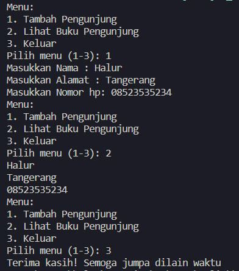


# **Laporan Jobsheet 1 Object Oriented Programming**


## **3. Percobaan**
### **3.1 Percobaan 1**
><p>Didalam percobaan ini, kita akan mendemonstrasikan bagaimana membuat class, membuat object, kemudian mengakses method didalam class tersebut.
1. Buka Netbeans, buat project SepedaDemo.
2. Buat class Sepeda. Klik kanan pada package sepedademo – New – Java Class.
3. Ketikkan kode class Sepeda dibawah ini.<p>

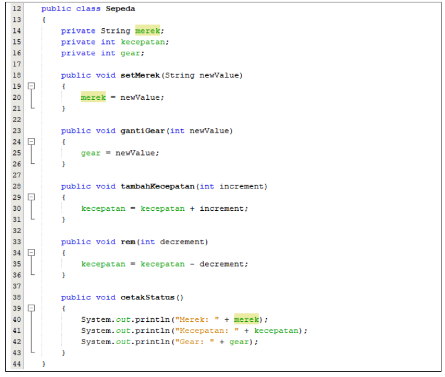

4. Kemudian pada class main, ketikkan kode berikut ini

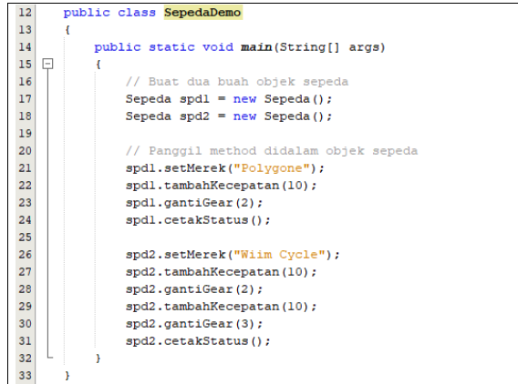

5. Cocokkan hasil

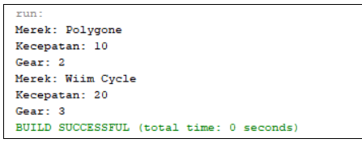

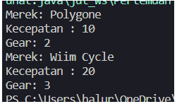

### **3.2 Percobaan 2**
><p>Didalam percobaan ini, akan didemonstrasikan salah satu fitur yang paling penting dalam PBO, yaitu inheritance. Disini kita akan membuat class SepedaGunung yang mana adalah turunan/warisan dari class Sepeda. Pada dasarnya class SepedaGunung adalah sama dengan class Sepeda, hanya saja pada sepeda gunung terdapat tipe suspensi. Untuk itu kita tidak perlu membuat class Sepeda Gunung dari nol, tapi kita wariskan saja class Sepeda ke class SepedaGunung. Penjelasan lebih detail tentang inheritance akan dibahas pada modul selanjutnya.
1. Masih pada project SepedaDemo. Buat class SepedaGunung.
2. Tambahkan kode extends Sepeda pada deklarasi class SepedaGunung. Kode extends ini
menandakan bahwa class SepedaGunung mewarisi class Sepeda.
3. Kemudian lengkapi kode SepedaGunung seperti berikut ini:
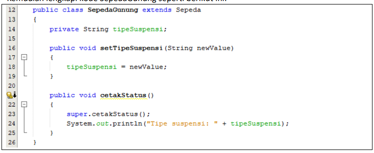
4. Kemudian pada class main, tambahkan kode berikut ini: 
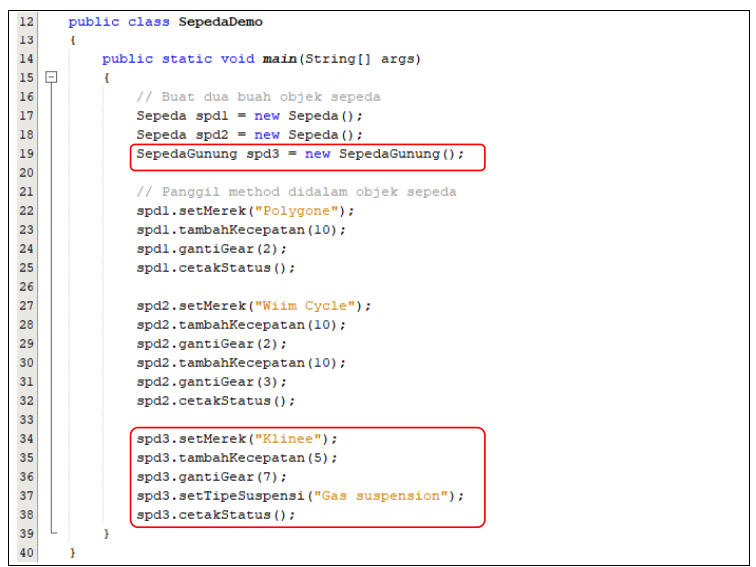
5. Cocokan hasil

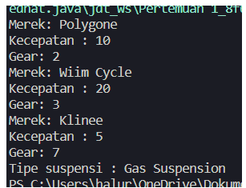

## **4 Kesimpulan**
Dari percobaan diatas, kita telah mendemonstrasikan bagaimana paradigma pemrograman
berorientasi objek dan mengimplementasikannya kedalam program sederhana. Kita juga telah
mendemonstrasikan salah satu fitur paling penting dari PBO yaitu inheritance, yaitu dalam hal
membuat class SepedaGunung.
Kita ketahui bahwa SepedaGunung pada dasarnya adalah sama dengan Sepeda (memiliki gear,
memiliki kecepatan, dapat menambah kecepatan, dapat mengerem, pindah gigi, dsb) namun ada
fitur tambahan yaitu tipe suspensi. Maka kita tidak perlu membuat class SepedaGunung dari nol,
kita extends atau wariskan saja dari class Sepeda, kemudian kita tinggal tambahkan fitur yang
sebelumnya belum ada di class Sepeda. Inilah salah satu kelebihan PBO yang tidak ada di
pemrograman struktural.
## **5. Pertanyaan**

1. Jelaskan perbedaan antara objek dengan class!
>Jawab : Object adalah suatu rangkaian dalam program yang terdiri dari state dan behavior. sedangkan class adalah blueprint atau prototype dari objek

2. Jelaskan alasan warna dan tipe mesin dapat menjadi atribut dari objek mobil!
>Jawab : Karena merupakan state dari sebuah mobil yang mempunyai sebuah warna dan tipe mesin yang berbeda dari setiap masing masing mobil
3. Sebutkan salah satu kelebihan utama dari pemrograman berorientasi objek dibandingkan
dengan pemrograman struktural!
>Jawab : Kelebiihan utama dari PBO atau pemrograman berorientasi objek adalah program dapat lebih fleksibel dan modular. Jika ada perubahan dalam sebuah kode, maka keseluruhan program tidak akan terganggu. Berbeda dengan struktural, perubahan sedikit saja kemungkinan dapat mengganggu keseluruhan program.
4. Apakah diperbolehkan melakukan pendefinisian dua buah atribut dalam satu baris kode seperti
“public String nama,alamat;”?
>Jawab : Boleh dan bisa dijalankan yang akan mendapatkan hasil yang sama jika dalam satu baris atau dua baris tetapi hanya bisa jika dalam tipe data yang sama  
5. Pada class SepedaGunung, jelaskan alasan atribut merk, kecepatan, dan gear tidak lagi ditulis di
dalam class tersebut!
>Jawab : Karena pada dasarnya sepeda gunung adalah sama dengan sepeda yang memiliki gear, kecepatan, dsb. namun ada fitur tambahan yaitu tipe suspensi, maka tidak perlu membuat class sepedaGunung dari awal atau nol. kita bisa me-extends atau mewariskan dari class sepeda, kemudian kita tinggal menambahkan fitur yang sebelumnya belum ada pada class sepeda.

## **6. Tugas Praktikum**
Lakukan langkah-langkah berikut supaya tugas praktikum yang dikerjakan tersistematis:

a. Foto 4 buah objek di sekitar kalian dengan 2 objek di antaranya merupakan objek yang mengandung konsep pewarisan (inheritance), contoh: kulkas, kursi, meja ruang tamu, meja belajar sehingga diketahui meja ruang tamu dan meja belajar mewarisi objek meja!
>Jawab
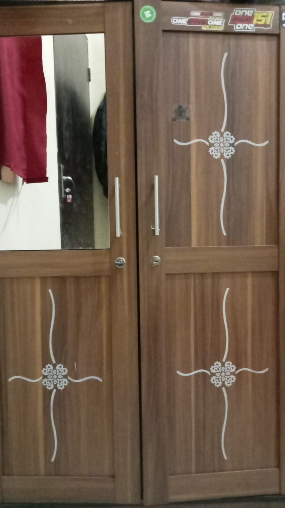
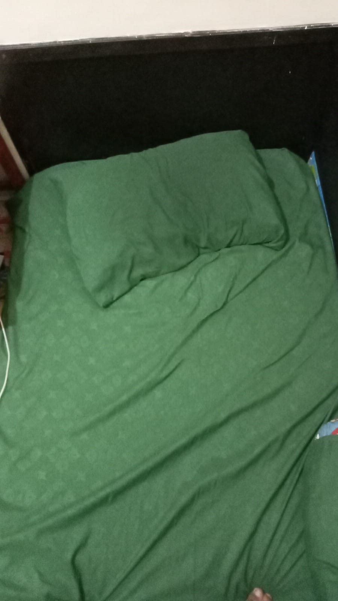
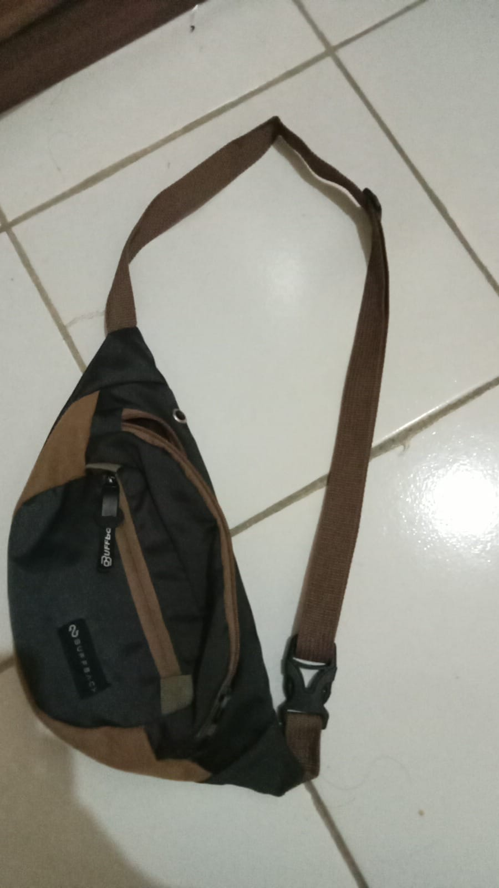
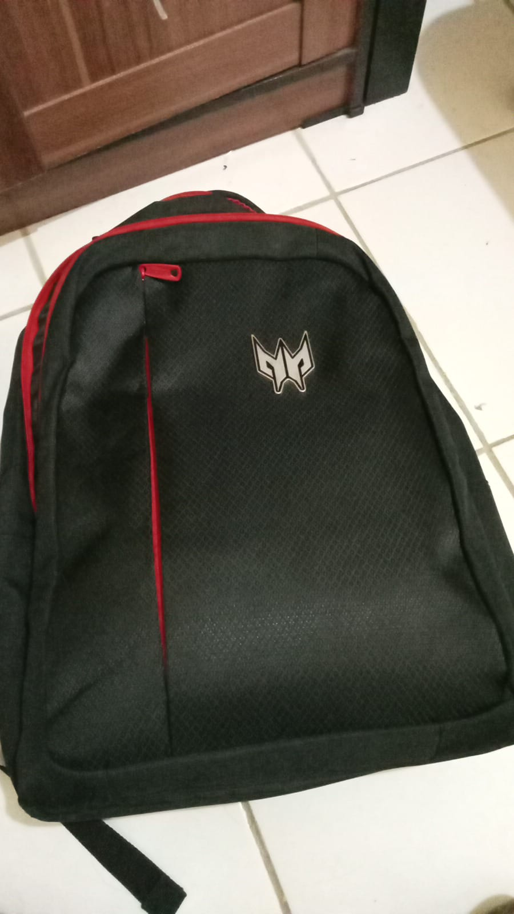

b. Lakukan pengamatan terhadap 4 objek tersebut untuk menentukan atribut dan methodnya!
><p>jawab
Lemari
 - ==Atribut===
 - Pintu : int
 - Panjang : int
 - ==Method===
 - jumlah() : int
 - Set_pintu() : void
 - printData(): void

Kasur
 - ==Atribut===
 - Panjang : int
 - lebar : int
 - ==Method===
 - Set_panjang() : void 
 - set_lebar() : void
 - hitung_luas() : int
 - printData() : void

tas pinggang 
 - ==Atribut===
 - Tipe Bahan : String
 - ==Method===
 - SetTipeBahan() : void
 - printData() : void

Tas Sekolah
 - ==Atribut===
 - Tipe Model : String
 - ==Method===
 - setTipeModel() : void
 - printData() : void

 //


c. Berdasarkan 4 buah objek tersebut, buat class nya dalam Bahasa pemrograman Java!
>Jawab
```java
public class lemari {
    int pintu, panjangLmr;

    public int hitungVolume(int panjang, int lebar, int tinggi){
        return panjang*lebar*tinggi;
    }
    public void printData(){
        System.out.println("Jumlah Pintu : "+ pintu);
        System.out.println("Panjang Lemari : "+ panjangLmr);
    }
}
```
```java
public class kasur {
    int panjang, lebar;
    public int hitungLuas(int panjang, int lebar){
        return panjang*lebar;
    }
    public void printData(){
        System.out.println();
    }
}
```
```java
public class tasPinggang extends tas {
    private String tipeBahan;

    public void setTipeBahan(String tipeBahan) {
        this.tipeBahan = tipeBahan;
    }

    public void printData(){
        super.printData();
        System.out.println("Tipe Bahan : "+ tipeBahan);;
    }
}
```
```java
public class tasSekolah extends tas {
    private String tipeModel;
    
    public void setTipeModel(String tipeModel) {
        this.tipeModel = tipeModel;
    }
    public void printData(){
        super.printData();
        System.out.println("Tipe Model : "+tipeModel);;
    }
}

```

d. Perlu diperhatikan bahwa terdapat dua class hasil pewarisan sehingga perlu menambah satu class baru sebagai class yang mewarisi dua class tersebut!
>jawab
```java
public class tas {
    private String merk;
    private int harga;
    private String warna;
    private int pjgTali;

    public void setMerk(String merk) {
        this.merk = merk;
    }
    public void setHarga(int harga) {
        this.harga = harga;
    }
    public String getMerk() {
        return merk;
    }
    public int getHarga() {
        return harga;
    }
    public void setWarna(String warna) {
        this.warna = warna;
    }
    public void setPjgTali(int pjgTali) {
        this.pjgTali = pjgTali;
    }
    public int getPjgTali() {
        return pjgTali;
    }
    
    public int tambah_pjgTali(int increment){
        return pjgTali = pjgTali + increment;
    }
    public int kurang_pjgTali(int decrement){
        return pjgTali = pjgTali - decrement;
    }
    public void printData(){
        System.out.println("Merk : "+merk);
        System.out.println("Harga :" +harga);;
        System.out.println("Warna : "+warna);;
        System.out.println("Panjang Tali : "+ pjgTali);
    }
}

```

e. Tambahkan dua atribut untuk setiap class!
>jawab
```java
//lemari
int lebarLmr;
int tinggiLmr;
```
```java
//kasur
int tebal;
String warna;
```
```java
//tas Pinggang
int tipeTali;
int jmlKompartmen;
```
```java
//tas Sekolah
int uk_kompartmenLaptop;
boolean tmptBotol;
```


f. Tambahkan tiga method untuk setiap classtermasuk method cetak informasi!
>jawab
```java
//Lemari
public void gantiUkuran(int newPanjang, int newLebar, int newTinggi){
        panjangLmr = newPanjang;
        lebarLmr = newLebar;
        tinggiLmr = newTinggi;
    }
public int hitungVolume(int panjang, int lebar, int tinggi){        
        return volume = panjang*lebar*tinggi;
    }

public void printData(){
        System.out.println("Jumlah Pintu : "+ pintu);
        System.out.println("Panjang Lemari : "+ panjangLmr);
        System.out.println("Lebar Lemari : "+ lebarLmr);
        System.out.println("Tinggi Lemari : "+ tinggiLmr);
        System.out.println("Volume Lemari : "+ volume);
    }
```
```java
//Kasur
public void setPanjang(int panjang) {
        this.panjang = panjang;
}
public void setLebar(int lebar) {
        this.lebar = lebar;
}
public int hitungLuas(int panjang, int lebar){
        return luas = panjang*lebar;
}
public void printData(){
        System.out.println("Panjang : "+panjang);
        System.out.println("Lebar : "+lebar);;
        System.out.println("Luas : "+ luas);;
}
```
```java
//Tas Pinggang
public void setTipeBahan(String tipeBahan) {
        this.tipeBahan = tipeBahan;
    }
public void setTipeTali(String tipeTali) {
        this.tipeTali = tipeTali;
    }

public void printData(){
        super.printData();
        System.out.println("Tipe Bahan : "+ tipeBahan);
        System.out.println("Tipe Tali : "+tipeTali);
    }
```
```java
//Tas Sekolah
public void setTipeModel(String tipeModel) {
        this.tipeModel = tipeModel;
    }
    public void setKompartmenLaptop(int uk_kompartmenLaptop) {
        this.uk_kompartmenLaptop = uk_kompartmenLaptop;
    }
    public void setTmptBotol(boolean tmptBotol) {
        this.tmptBotol = tmptBotol;
    }

    public void printData(){
        super.printData();
        System.out.println("Tipe Model : "+tipeModel);;
        System.out.println("Kompartmen Laptop :"+uk_kompartmenLaptop);;
        System.out.println("Tempat Botol : "+tmptBotol);;
    }
```

g. Tambahkan satu class Demo sebagai main!
>jawab
```java
public class demo {
    public static void main(String[] args) {

    }
}
```

h. Instansiasikan satu buah objek untuk setiap class!
>jawab
```java
lemari lmr1 =new lemari();
kasur ksr1 = new kasur();
tas tas1 = new tas();
tasPinggang tas2 = new tasPinggang();
tasSekolah tas3 = new tasSekolah();
```

i. Terapkan setiap method untuk setiap objek yang dibuat!
>jawab
```java
public class demo {
    public static void main(String[] args) {
        lemari lmr1 =new lemari();
        kasur ksr1 = new kasur();
        tas tas1 = new tas();
        tasPinggang tas2 = new tasPinggang();
        tasSekolah tas3 = new tasSekolah();


        System.out.println("====LEMARI====");
        lmr1.setPanjangLmr(80);
        lmr1.setLebarLmr(20);
        lmr1.setTinggiLmr(70);;
        lmr1.setPintu(2);;
        lmr1.setWarna("coklat");;
        lmr1.hitungVolume();
        lmr1.printData();
        System.out.println("=============");

        System.out.println("===KASUR===");
        ksr1.setPanjang(200);
        ksr1.setLebar(50);;
        ksr1.setTebal(10);
        ksr1.setWarna("Biru");
        ksr1.hitungLuas(ksr1.panjang, ksr1.lebar);
        ksr1.printData();;
        System.out.println("=============");


        System.out.println("====TAS====");
        tas1.setMerk("POLO");
        tas1.setHarga(200000);
        tas1.setPjgTali(30);;
        tas1.setWarna("Hitam");;
        tas1.printData();;
        System.out.println("=============");
        
        System.out.println("===TAS PINGGGANG===");
        tas2.setMerk("EIGER");
        tas2.setHarga(150000);
        tas2.setPjgTali(30);;
        tas2.setWarna("Coklat");;
        tas2.setTipeBahan("Anti Air");;
        tas2.setTipeTali("Kain");;
        tas2.printData();
        System.out.println("=============");


        System.out.println("===TAS SEKOLAH===");
        tas3.setMerk("NIKE");
        tas3.setHarga(300000);
        tas3.setPjgTali(30);;
        tas3.setWarna("Merah");;
        tas3.setTipeModel("Classic");
        tas3.setKompartmenLaptop(15);
        tas3.setTmptBotol(true);;
        tas3.printData();
        System.out.println("=============");
    }
}
```

j. Contoh yang telah disebutkan pada poin 1.a tidak diperbolehkan dipakai dalam pengerjaan tugas praktikum ini!


